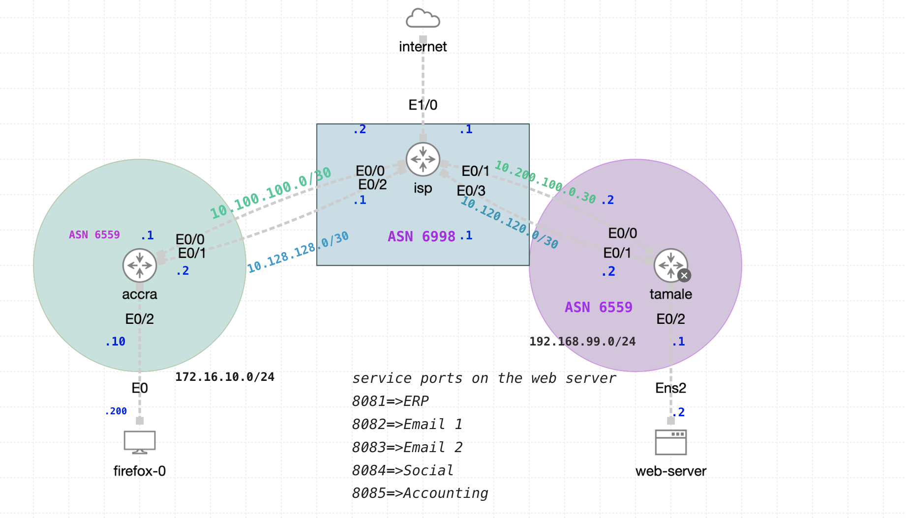
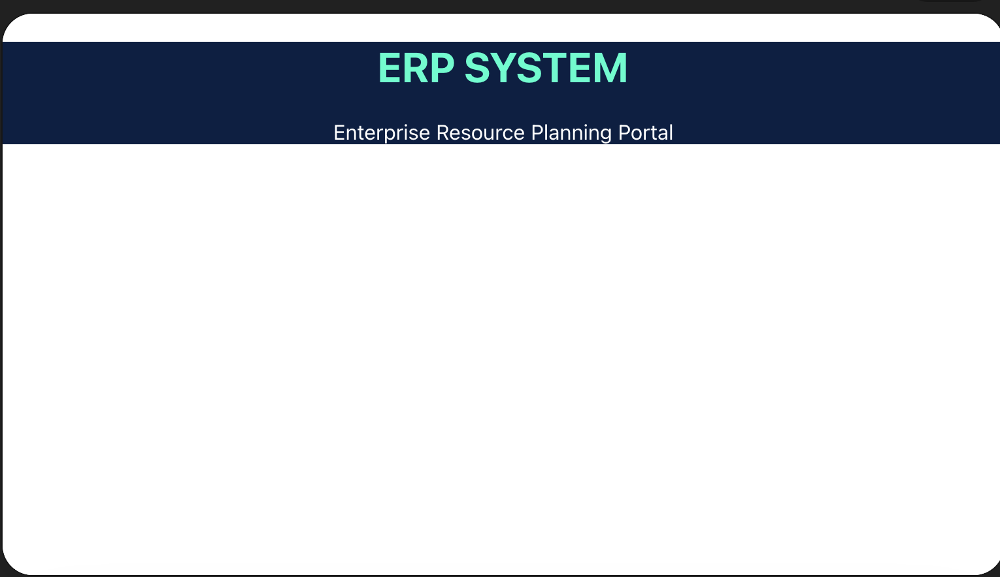
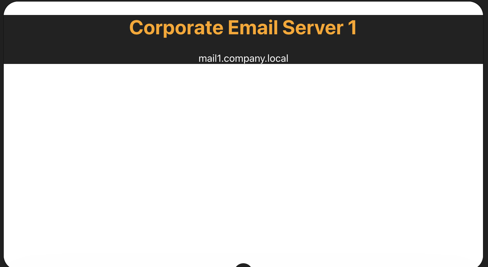
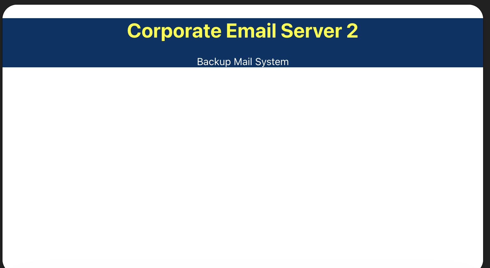
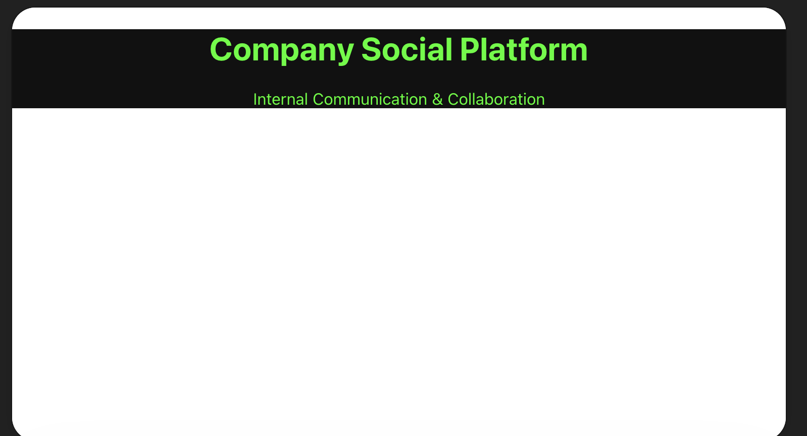
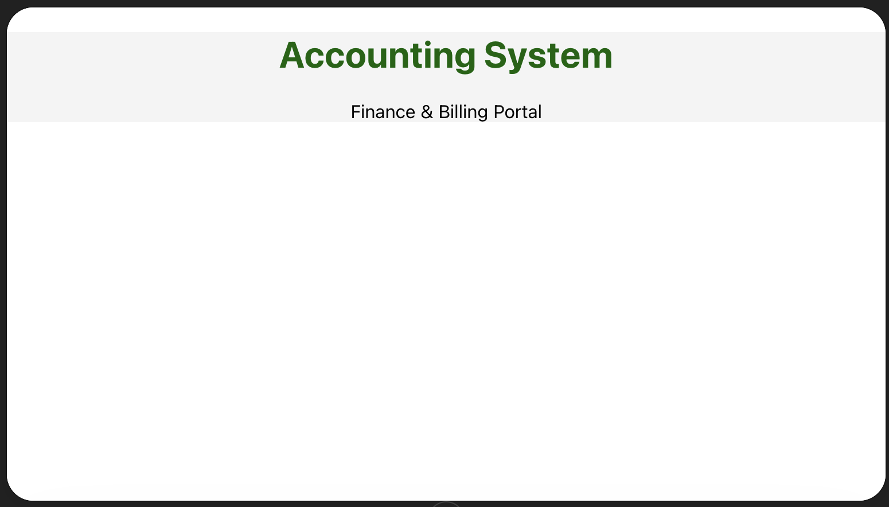

# Project 255

Project 255 is a small network design project created in Cisco Modeling Labs (CML) with a total of five devices.

The company has two office locations:

- **Headquarters (HQ)** located in Accra
- **Branch site** located in Tamale

## Accra (HQ)

The Accra headquarters has an internet connection from an ISP. The ISP provides two links to the Accra site:

- **Primary link:** Fiber optic
- **Secondary link:** Microwave radio

The Accra site has full internet access.

## Tamale Site

The Tamale site hosts the company’s server farm. It is connected to the same ISP using two links, similar to the Accra site. However, the Tamale site does not have a direct internet connection.

## Interconnection Between Sites

The ISP connects both sites together through its network, allowing them to share common resources:

- The Accra site can access all servers hosted in Tamale.
- The Tamale servers can access the internet through the Accra site.

This design ensures redundancy at both locations while maintaining centralized internet access through the Accra headquarters.

---

## Network Topology

## Server Infrastructure

The web server is an Ubuntu Server configured to simulate multiple internal company services.  
These services are hosted on different port numbers to mimic real-world enterprise servers.

### Hosted Services

The following services are configured on the Ubuntu server:

- **Port 8081** → ERP System  
- **Port 8082** → Email Server 1  
- **Port 8083** → Email Server 2  
- **Port 8084** → Social Platform  
- **Port 8085** → Accounting System  

These websites are created to mimic actual production servers within an organization.

All services are accessible using the server’s IP address followed by the respective port number.

**Example:**
##
**ERP**

##
**CORPORATE EMAIL1**

##
**CORPORATE EMAIL2**

##
**COMPANY SOCAIL PLATFORM**

##
**ACCOUNITING SYSTEM**

